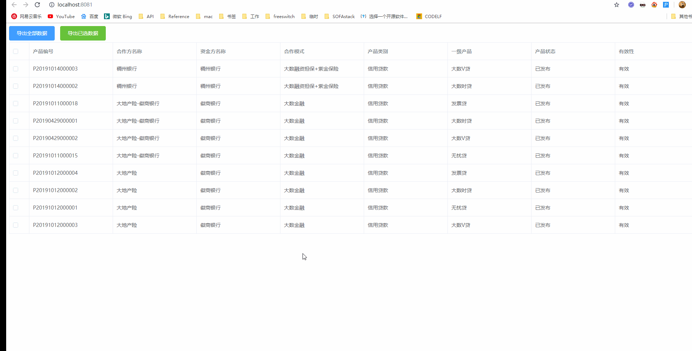

# demo

> 纯前端导出示例

### 效果演示



## 运行步骤

``` bash
# install dependencies
npm install

# serve with hot reload at localhost:8080
npm run dev
```

### 移植步骤

##### 添加依赖库

```bash
# 安装js-xlsx和file-saver依赖库
npm install xlsx file-saver -S
```

##### 添加封装函数

将 `src/utils/Export2Excel.js` 文件拷贝到项目中

##### 使用组件

1. 动态导入

```javascript
import('@/utils/Export2Excel').then(excel => {
  excel.export_table_to_excel({ tableRef, filename, selection })
})
```

2. 全局导入

```javascript
import excel from '@/utils/Export2Excel'

excel.export_table_to_excel({ tableRef, filename, selection })
```

使用示例见 `src/components/Table.vue`


参考:  [https://panjiachen.github.io/vue-element-admin-site/zh/feature/component/excel.html#excel-%E5%AF%BC%E5%87%BA](https://panjiachen.github.io/vue-element-admin-site/zh/feature/component/excel.html#excel-导出)

